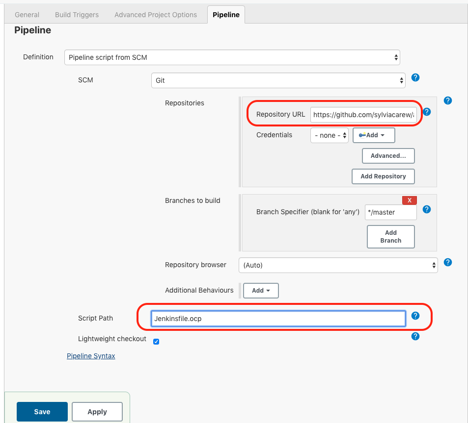
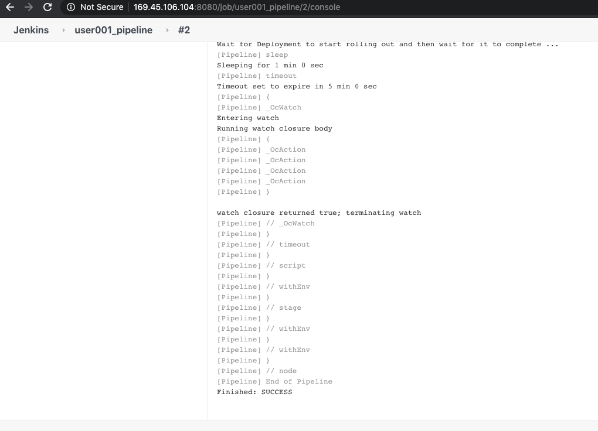
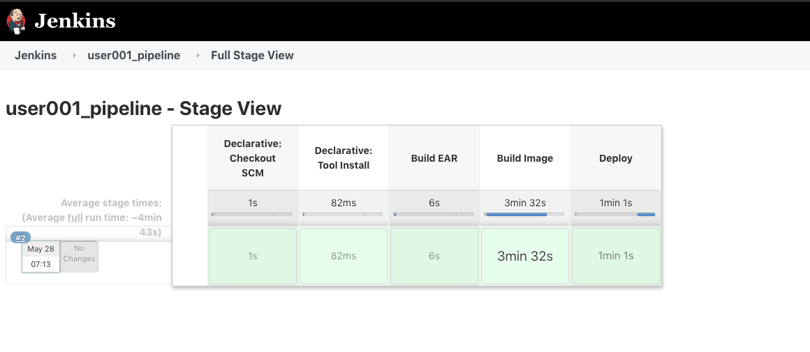

# IBM Client Developer Advocacy App Modernization Series

## Lab - Automated updates of containerized applications from SCM commits

### Creating a CI/CD Pipeline for deployment to OpenShift  using Jenkins

## Overview

In this lab you will  be connecting your Git repository with the Plants by WebSphere app to a Continuous Integration/Continuous Deployment pipeline built with Jenkins that will deploy to an OpenShift cluster.

## Setup

If you haven't already:

Complete either one of these lab exercises:

- [Working with Templates](https://github.com/IBMAppModernization/app-modernization-openshift-templates-lab-shared)
- [Working with S2I and Templates](https://github.com/IBMAppModernization/app-modernization-openshift-s2i-templates-lab-shared)

### Step 1: Fork the Github repo that contains the code for the Plants by WebSphere app

 1.1 From your terminal go back to your home directory

   ```bash
   cd ~
   ```

 1.2 Go to the folder where you cloned the Plants by WebSphere app in the previous lab

   ```bash
   cd app-modernization-plants-by-websphere-jee6
   ```

 1.3 Use the `hub` utility to fork the Plants by WebSphere repo to your own Github account

   ```bash
   hub fork -remote-name origin
   ```

 1.4 Enter your Github credentials when prompted

 1.5 In your browser go to Github, login if prompted,  and verify that a fork of the Plants by WebSphere repo has been created in your account

### Step 2: Set up the CI/CD pipeline

In this section we will be connecting our cloned Git repo of [this app](https://github.com/IBMAppModernization/app-modernization-plants-by-websphere-jee6)  to set up a Continuous Integration/Continuous Deployment pipeline built with Jenkins. This pipeline contains 4main  steps as follows:

  | Stage                         | Purpose                                                                        |
  | ----------------------------- | ------------------------------------------------------------------------------ |
  | Build Application ear File    | Pulls in dependencies from Maven and packages application into .ear file       |
  | Build Image            | Uses a S2I builder to build the image for this app                              |
  | Deploy App      | Updates the image tag in the OpenShift deployment and then triggers a rolling update |

More details of this pipeline can be found in the [Jenkinsfile](https://raw.githubusercontent.com/IBMAppModernization/app-modernization-plants-by-websphere-jee6/master/Jenkinsfile.ext).

2.1 Log into Jenkins using the URL provided to you by your instructor with the credentials provided to you

2.2  The pipeline should have already been created for you.

   

2.3 Click on your pipeline to open it and then click on the **Configure** link in the navigation area at the left to change it's properties

2.4 Scroll down to the **Build Trigger** section and select **GitHub hook trigger for GIT SCM polling**

   

2.5 Scroll down to the **Pipeline** section and find the **Definition** drop down menu. Select **Pipeline script from SCM** and for **SCM** select **Git**.

2.6 For **Repository URL** enter the url to the cloned repository that you forked earlier (i.e. `https://github.com/[your username]/app-modernization-plants-by-websphere-jee6.git`)

2.7 Verify that the  **Script Path** is set to `Jenkinsfile.ocp`

   

2.8 Click **Save**.

### Step 3: Manually trigger a build to test pipeline

3.1 In Jenkins in the navigation area on the left click on **Build with Parameters**. Accept the defaults of the parameters and click on **Build**

3.2 To see the console output click on the build number in the **Build History** and then click on **Console Output**

   

3.3 If the build is successful the end of the console output should look like the following:

   

&nbsp;&nbsp;&nbsp;&nbsp;&nbsp;&nbsp;The Stage View of the pipeline should look like the following:
   

### Step 4: Trigger a build via a commit to Github

Now you'll configure Github to trigger your pipeline whenever code is committed.

4.1 Go back to Github and find your cloned repository

4.2 Click on the repository settings

   

4.3 Under **Options** select **Webhooks** and click **Add webhook**

   

4.4 For the Payload URL use `<Jenkins URL>/github-webhook/`  where `<Jenkins URL>` is the  URL you used  to login to Jenkins (**Note** Don't forget the trailing `/`)

4.5 Change content type to **application/json**

4.6 Accept the other defaults and click **Add webhook**

   

4.7 In the Github file browser drill down to *pbw-web/src/main/webapp/promo.xhtml*

4.8 Click on the pencil icon to edit **promo.xhtml**  and on line 95 locate the price of the Bonsai Tree

4.9 Change  `$30.00 each` to `<strike>$30.00</strike> $25.00 each`

   This will show the price of the Bonsai Tree as being reduced even more

   

4.10 At the bottom of the UI window add a commit message and click on **Commit changes**

4.11 Switch back to Jenkins  and open the pipeline that you were working on  earlier.

4.12 Verify that your pipeline  starts building.

4.13 When the pipeline is finish deploying, launch the app to verify the change you made.

4.14 .Run the following command in  the terminal to get the URL of your deployed app

   ```bash
   oc get route pbw-liberty-mariadb  --template='http://{{ .spec.host }}'
   ```

4.15 Enter the URL in your browser's address bar and verify that the price of the Bonsai tree has been reduced.

   

### Clean up

Run the following commands from the terminal to delete the resources you created:

```bash
oc delete all,secrets --selector template=mariadb-ephemeral-template
oc delete all --selector app=pbw-liberty-mariadb
```

## Summary

You worked with a Jenkins pipeline to automatically build and deploy an app that has been updated in Github .
